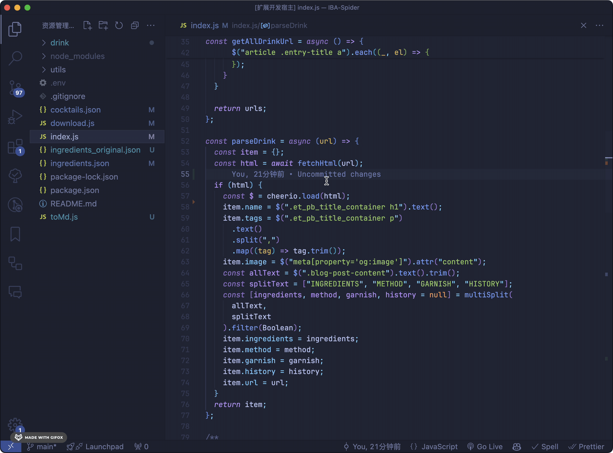

# Moyu Leap

Moyu Leap 能帮助你用最少的按键次数将光标移动到指定位置，不借助鼠标！

受 [leap.nvim](https://github.com/ggandor/leap.nvim) 的启发

## 使用方法

使用方法与 leap.nvim 类似

1. 按下 `cmd+m` 进入搜索模式
2. 按下两个要搜索的字符 `{char1}{char2}`，如果只有一个匹配结果，光标会直接跳转到该位置
3. 如果有多个匹配结果，moyu leap 会在所有匹配结果上显示一个 label，按下对应 label 的字符即可跳转到该位置

## TODO

- [ ] 前置搜索
- [ ] 重复搜索
- [ ] 遮罩提示
