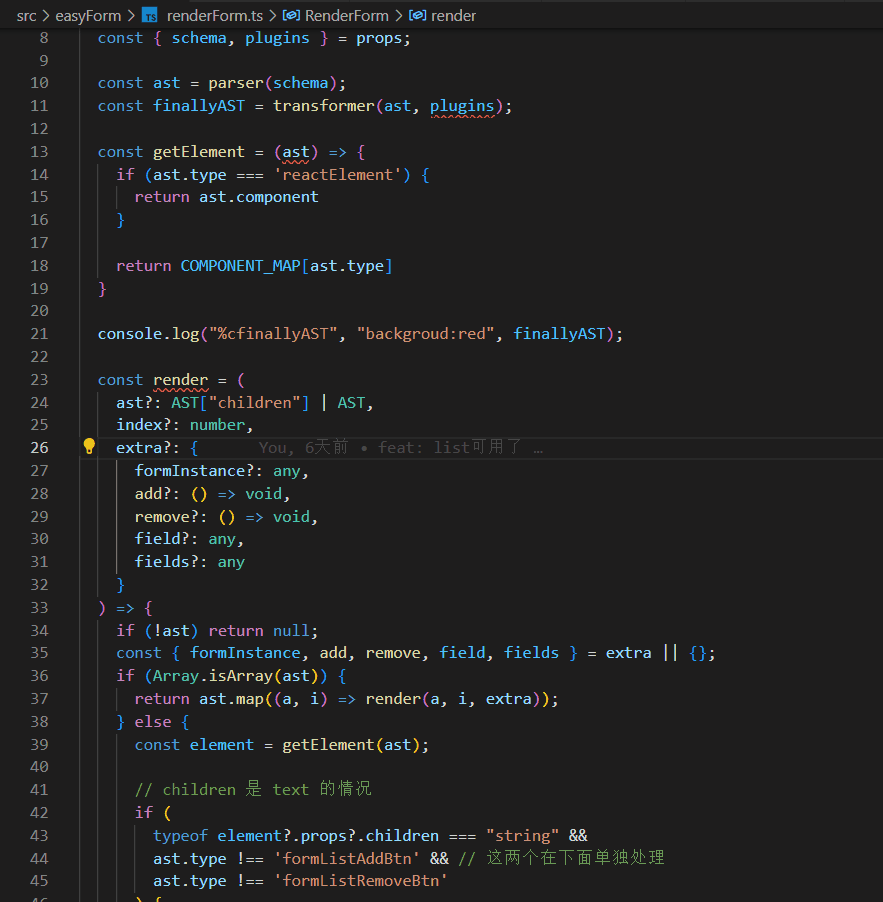

# Moyu-Template

以 vscode 插件的形式提供更多快捷指令，尽量减少使用鼠标的次数。

## 使用方法

moyu-template 提供了以下的几个 Commands 和 Keybindings。对于 Commands 可以使用 `shift+cmd+p` 唤起 vscode 控制谈，输入对应命令就可以了。对于 Keybindings 建议在键盘快捷方式中搜索 `moyu` 就能找到所有命令了，然后根据自己喜好更改即可。

## Commands

| 命令                    | 功能                                                      |
| ----------------------- | --------------------------------------------------------- |
| new component           | 在当前目录下新建`./components/${componentName}/index.tsx` |
| new component in global | 新建`@/components/#{componentName}/index.tsx`             |
| new page                | 新建`@/pages/${pagename}/index.tsx`                       |
| new file                | 新建一个文件在当前文件夹                                  |

## Keybindings

| 命令                      | 功能                                   | 默认按键              |
| ------------------------- | -------------------------------------- | --------------------- |
| moyu.select neareast word | 在当前行中，选中距离光标最近的一个单词 | `shift` + `cmd` + `/` |
| moyu.select next word     | 在当前行中，选中下一个单词             | `shift` + `cmd` + `.` |
| moyu.select pervious word | 在当前行中，选中上一个单词             | `shift` + `cmd` + `,` |
| moyu.select next brackets | 在当前行中，移动光标到下一个`(`后面    | `shift` + `cmd` + `9` |
| moyu.search mode          | 开启 [search mode](#search-mode)       | `shift` + `cmd` + `0` |

### Search Mode

灵感来自 [vim-easymotion](https://github.com/easymotion/vim-easymotion)，可快速定位光标到任意位置

### TODO

- [ ] log
- [ ] 快速滚动
